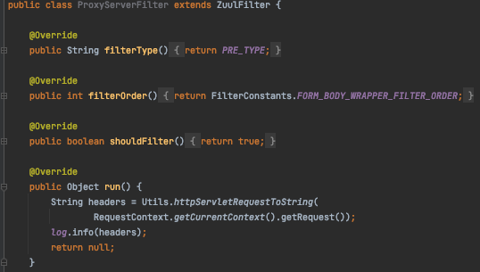
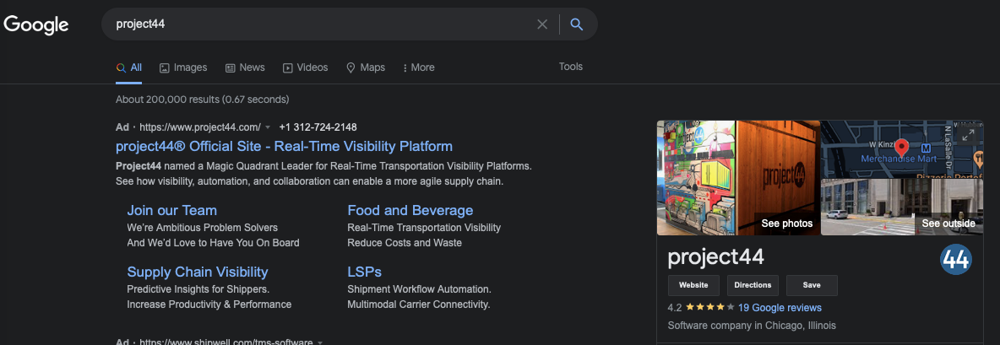

# PROXY-SERVER
Simple proxy server that logs the headers of all the HTTP requests it forwards.

### How it works
This app uses Netflix Zuul who works as a proxy to redirect requests to google.com.
1. A request is received from /google/ who is the route for Google (zuul.routes.google.path) 

2. The incoming request is identified by Zuul (PRE_TYPE) and managed by ZuulFilter (before to be redirected)
3. The filter (ProxyServerFilter) logs the request headers using the 'run' method

4. Finally, Zuul redirects the request to zuul.routes.google.url (https://google.com)


### How to execute
1. Running unit tests and make jar file:
```
./gradlew clean test bootJar
```
2. Building image:
```
docker build --tag=proxy-server:latest .
```
3. Run
```
docker run -p8080:8080 proxy-server:latest
```

### PROXY-SERVER details
Path base: `http://localhost:8080/google/search?q=<criteria>"`

